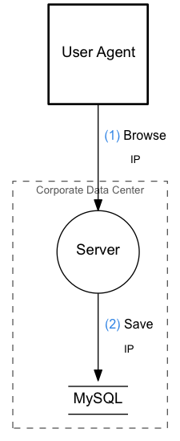
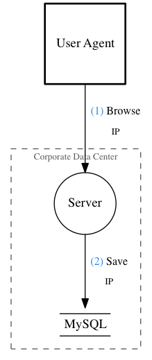
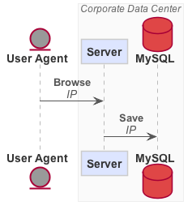

# Visualizing Your System with DataFlow

Writing good documentation is hard. Keeping documentation up-to-date is even
harder.  In recent Sony projects me and my colleagues have been working with
documenting data flows in systems to enable security reviews of our software.
When we started with this work we decided to generate these documents, not only
for the sake of security reviews but also to have a living documentation that
developers can maintain and have use for when working in our projects.

The tool that emerged is a program called *DataFlow*. It stands of the
shoulders of giants by leveraging great software such as
[graphviz](http://graphviz.org/) and [PlantUML](http://plantuml.com/) together
with the [Data flow diagram](https://en.wikipedia.org/wiki/Data_flow_diagram)
format. DataFlow is open sourced under the BSD-3 license and the source is
available [on GitHub](https://github.com/sonyxperiadev/dataflow).

> A DFD shows what kind of information will be input to and output from the
> system, where the data will come from and go to, and where the data will be
> stored. It does not show information about the timing of process or
> information about whether processes will operate in sequence or in parallel
> (which is shown on a flowchart).
>
> <footer>&ndash; <a href="https://en.wikipedia.org/wiki/Data_flow_diagram">Data flow diagram (Wikipedia)</a></footer>

The program DataFlow uses an input format inspired by [the Dot
language](http://www.graphviz.org/doc/info/lang.html) used with graphviz - a
high-level markup format for data flows in systems. We use the `.flow` file
extension for our diagram sources.

```dot
/* my-diagram.flow */
diagram {
  io agent {
    title = "User Agent"
  }

  boundary datacenter {
    title = "Corporate Data Center"

    function server {
      title = "Server"
    }

    database db {
      title = "MySQL"
    }
  }

  agent -> server {
    operation = "Browse"
    data = "IP"
  }

  server -> db {
    operation = "Save"
    data = "IP"
  }
}
```

## Output Formats

Using this input DataFlow can process and transform it into a number of output
formats. The main output format is DFD which uses graphviz for rendering.

```bash
$ dataflow dfd my-diagram.flow | dot -Tpng -o my-diagram.png
```

This outputs an PNG file called `my-diagram.png` which looks like this:



As you may have noticed the `dataflow` executable does not output the actual
graphics itself, it prints Dot output which you can pipe to graphviz programs.
This makes it simple to compose with graphviz and customize how rendering
should be done.

```bash
$ dataflow dfd my-diagram.flow | dot -Tpng -Gfontname="Times" -Nfontname="Times" -Efontname="Times" -o my-diagram-times.png
```

Here we override to use the Times New Roman font for all labels, resulting in
the following image.



Even though DataFlow is mainly built for rendering DFDs it is possible to
get sequence diagram output as well, using PlantUML. Large DFDs can be quite
hard to read so we use sequence diagrams as a simpler way to visualize the
order of flows.



## Composability

After having setup the automated graphics build of our documentation we saw an
opportunity to generate even more of the documentation while still maintaining
a single source of truth. By extending the DataFlow input format to support
arbitrary attributes in diagrams, nodes and flows along with a [JSON Graph
Format](https://github.com/jsongraph/json-graph-specification) output, we could
now build other tools on top of DataFlow.

```json
{
  "graph": {
    "metadata": {},
    "edges": [
      {
        "metadata": {
          "operation": "Browse",
          "data": "IP"
        },
        "source": "agent",
        "target": "server"
      },
      {
        "metadata": {
          "operation": "Save",
          "data": "IP"
        },
        "source": "server",
        "target": "db"
      }
    ],
    "nodes": [
      {
        "metadata": {
          "type": "io"
        },
        "id": "agent",
        "label": "User Agent"
      },
      {
        "metadata": {
          "trust-boundary": "datacenter",
          "type": "function"
        },
        "id": "server",
        "label": "Server"
      },
      {
        "metadata": {
          "trust-boundary": "datacenter",
          "type": "database"
        },
        "id": "db",
        "label": "MySQL"
      }
    ]
  }
}
```

One tool that we built on top of the DataFlow JSON output generates an HTML
overview of threats and requirements in the system. We list threats in data
flows using an array of threat IDs.

```dot
agent -> server {
  operation = "Login"
  data = "Sensitive stuff"
  threats = ["mitm"]
}
```

We have another file that contains a registry of threats and the requirements
for mitigating them.

```json
{
  "threats": {
    "mitm": {
      "description": "Man-in-the-middle attack.",
      "requirements": "HTTPS"
    }
  }
}
```

Using the JSON output in DataFlow and a simple script we link the references in
flows with the threats file to create an overview of all threats and what parts
of the system that are affected.

Another neat trick we have employed recently is to print warnings for all flows
of data that crosses trust boundaries without listing any threats. These kinds
of tools are simple to construct when we are working with data. However, using
the consise input format of DataFlow, we are not sacrifising readability or
productivity.

## Getting Started with DataFlow

For more information on how to install and get started with DataFlow, please
visit [sonyxperiadev/dataflow on
GitHub](https://github.com/sonyxperiadev/dataflow) and check out the README.
Binaries are available for OSX, Linux binaries are coming up soon. There is also
[a Docker image available](https://hub.docker.com/r/owickstrom/dataflow/).

If you experience any issues please report them as [GitHub
Issues](https://github.com/sonyxperiadev/dataflow).

## Bonus

**TODO:** Write something about the vim plugin.
